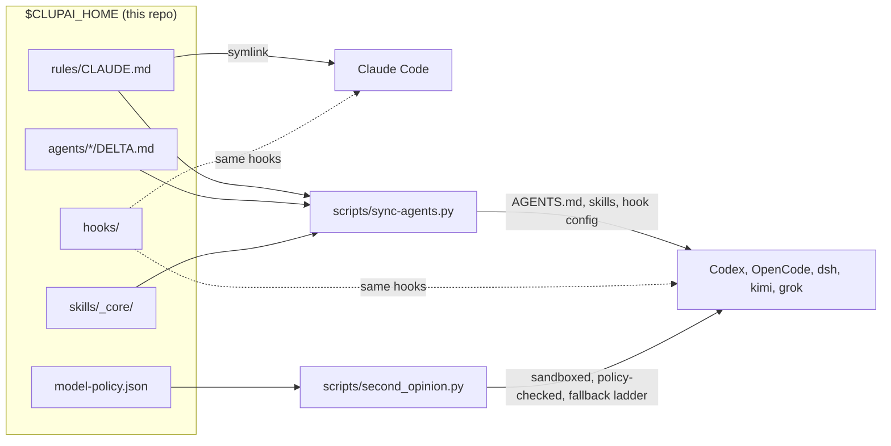

# clupai-skills

**One shared rules, hooks and skills layer for Claude Code, Codex, OpenCode, DeepSeek, Kimi and Grok Build, tuned by measurement to spend fewer tokens.**

This is the setup Clupai runs every day: several agent sessions on the same repos at once, one set of rules, and a
bake-off-backed rule for which model does what.

## Why it saves tokens

Measured Sep 2026. The routing benchmark used tasks built from real work with planted bugs and defects
([docs/routing.md](docs/routing.md)); the bake-off used real commits from one app ([docs/bake-off.md](docs/bake-off.md)).

| Rule | Measured effect |
|---|---|
| Subagents run Opus 5 at **low** effort, always pinned | 96-100% on every scored task; $0.33/task vs $0.90 at xhigh (2.7x), no meaningful gain |
| No "cheap model works, Opus reviews" | $0.78 vs $0.33 for Opus low alone, same score |
| Reviews go to Codex or DeepSeek, outside Claude | Almost no Claude usage; DeepSeek V4 Flash found the most real bugs (9 of 17) of the models tested (Opus was not run on review) |
| Bulk coding on DeepSeek V4 Flash, then a review pass | 10/10 tasks for ~$1.50 vs $20.60 on Opus 5 |
| Reset context near 200k | A call at 600-900k costs ~3x a call at 200k (estimate: $0.38 vs $0.13) |
| Do lookups inline, not in an agent | Every agent pays setup tokens first (estimate: 30-50k) |
| Skills load on demand, not all installed | The skill listing cost tokens in every agent (estimate: ~7.5k before cleanup) |
| Memories recalled per prompt, not preloaded | `MEMORY.md` shrinks to pinned notes; the rest arrives when relevant |

## How it fits together



More: [docs/architecture.md](docs/architecture.md).

## What each hook does

| Hook | One line |
|---|---|
| `hooks/claims.py` | Claims each file a session edits; blocks two sessions editing one file in one worktree; keeps status notes and history |
| `hooks/queues.py` | Gives one session at a time a turn on a shared target, like a staging deploy or a merge |
| `hooks/guardrails.py` | Rules learned from failures (warn, stop, queue, deny) that every later session gets |
| `hooks/memory_guard.py` | Blocks new agents and heavy commands when the Mac is low on memory |
| `hooks/memory_recall.py` | Adds only the memories that match the prompt, from every account |
| `hooks/effort_gate.py` | Makes the model state the effort a task needs, and ask you to change it early in a session |
| `hooks/agent_hook.py` | Lets Codex, OpenCode, dsh, kimi and Grok Build run the same hooks as Claude Code |
| `hooks/codex_hook.py` | Shim to `agent_hook.py` for Codex |

## What else is here

| Path | What |
|---|---|
| `rules/CLAUDE.md` | Global rules template: claims, queues, guardrails, memory, token economy, second-model review, short documents, close lines |
| `skills/_core/token-economy` | Picks model, effort and route for every subagent and second opinion |
| `skills/_core/tool-scoping` | Puts skills, MCP servers and keys only where they are used |
| `skills/_core/vault-skills` | Loads a library skill on demand. The repo ships only `_core`; the library (`skills/<category>/`) is yours to add |
| `scripts/second_opinion.py` | Calls outside models through one sandboxed, policy-checked fallback ladder |
| `scripts/sync-agents.py` | Generates each agent's `AGENTS.md` and links skills and hooks |
| `scripts/build_index.py` | Rebuilds `skills/INDEX.md` |
| `output-styles/on-the-go.md` | Replies for reading on a phone: answer first, decisions as a checklist, recap at the end |
| `ui/` | Shared statusline and palette |
| `bakeoff/` | Generic harness to run your own model bake-off on your repo's history |
| `examples/` | `model-policy`, `guardrails` and Claude `settings` hooks to start from |
| `tools/export.py` | How this repo is refreshed from the private copy, with a leak scan |
| `.sync-agents-skip` | Put this empty file in a folder so `sync-agents.py --repos` never links an `AGENTS.md` there (`rules/` has one) |

## Quick start

```bash
git clone <this repo> ~/clupai
cd ~/clupai
./install.sh                       # prints the plan, changes nothing
./install.sh --yes --settings      # links rules, skills, output style; merges hooks into ~/.claude/settings.json
export CLUPAI_HOME=~/clupai        # add to your shell profile
```

- **This replaces `~/.claude/CLAUDE.md`** with a link to `rules/CLAUDE.md`. The old file is backed up next to it.
- To keep your own file instead: `./install.sh --yes --no-rules`, then add the line `@~/clupai/rules/CLAUDE.md` to it.
- Edit `model-policy.json` so your folders get the right policy. Unlisted folders are confidential.
- Other agents: install their CLIs, then `./install.sh --yes --agents`. It only runs `sync-agents.py --check` and
  prints the command to apply it.
- Codex will not run a new `hooks.json` until you open `codex` once interactively and approve it.
- More than one Claude account: `CLAUDE_DIRS="$HOME/.claude $HOME/.claude-exec" ./install.sh --yes`.

## Model routing

| Model | Route | Role |
|---|---|---|
| Opus 5 | Claude Code | Main worker, low effort for subagents |
| Fable 5.1 | Claude Code | Hardest tasks, final review |
| GPT-6 Astra | `codex` | Independent reviewer, fast on long tasks |
| DeepSeek V4 Flash | `dsh:deepseek-flash` | Bulk worker and reviewer; always follow its code with a review |
| Gemini 3.8 Flash | `agy:gemini-3.8-flash-high` | Free quick drafts and reads (plan quota) |
| Grok 4.7 (Grok Build) | `grok:grok-4.7` | Second reviewer when Codex is out of quota; Grok plan quota; personal folders only |
| Kimi K3 | `kimi:kimi-k3` | Backup if DeepSeek is down |

Bake-off in one line each (10 real tasks from a production React Native + Firebase app):

- Every top model passed 10/10, so speed, cost and code quality decided.
- DeepSeek V4 Flash: 10/10 for ~$1.50 and the most review bugs found, but 34-54% more defects than Claude.
- Fable 5.1 wrote the cleanest code; Opus 5 was close and ~25% cheaper.
- Grok Build: 10/10 coding, 2 of 3 bugs on the one review case run. Grok 4.7 via OpenRouter found 7 of 17.
- GPT-6 Astra + Fable + DeepSeek Flash together found every bug any reviewer found.
- Every model missed most security-rules bugs. Those still need a human.

## Limits

- **macOS first.** The outside-model sandbox uses `sandbox-exec`; the memory guard reads macOS stats.
- **One person's data.** The routing benchmark ran 2 runs per setup; the bake-off ran each task once per model, on one app.
  Run `bakeoff/` on yours.
- **Model names and prices age fast.** All numbers are from Sep 2026. Codex ran gpt-5.6-sol in the routing
  benchmark and GPT-6 Astra in the bake-off.
- **Hooks fail open.** A broken script never blocks work, so check `claims.py list` works after install.
- **`sync-agents.py` edits other tools' config** (Codex `hooks.json` and `config.toml`, kimi and grok `config.toml`,
  dsh profiles). Backups are timestamped and never overwritten. Claude settings and Codex `[tui]` change only with
  `--ui`, and repo `AGENTS.md` links only with `--repos`, at a repo's git top level. Run `--check` first.
- **Outside models may keep or train on what you send.** That is what `model-policy.json` is for.
- **The `ui/` palette follows a kitty accent file** if you have one; otherwise it uses the default.

## Third-party skills used alongside (not included)

| Skills | Upstream |
|---|---|
| docx, pdf, pptx, xlsx, skill-creator, mcp-builder, canvas-design, theme-factory, algorithmic-art | [anthropics/skills](https://github.com/anthropics/skills) |
| brainstorming, systematic-debugging, test-driven-development, using-git-worktrees, subagent-driven-development | [obra/superpowers](https://github.com/obra/superpowers) |
| context-compression, context-degradation, memory-systems, multi-agent-patterns, tool-design | [muratcankoylan/Agent-Skills-for-Context-Engineering](https://github.com/muratcankoylan/Agent-Skills-for-Context-Engineering) |
| mem-search, make-plan, smart-explore | [thedotmack/claude-mem](https://github.com/thedotmack/claude-mem) |
| vercel-react-best-practices, web-design-guidelines | [vercel-labs/agent-skills](https://github.com/vercel-labs/agent-skills) |

## License

MIT, Clupai. See [LICENSE](LICENSE).
